# basic_linux_command
Basic Linux Command Project 

# Linux Fundamentals Project

## Overview
This project demonstrates hands-on Linux proficiency through system navigation, file manipulation, and directory organization in an Ubuntu virtual machine.

## Tasks Completed (Screenshot confirmation for all the practiced commands and activies have been attached below)

### **1. Directory Creation & Navigation**
- Created directories using `mkdir`, both with and without `sudo` (required `sudo` for `/`).
- Verified folder creation in `/root` using:
  ```bash
  sudo ls /root

- Explored the system using:
    ```bash
    sudo ls /bin /etc /home /root /var /usr

- Navigated between directories using cd.


### **2. Working with File Commands**
- Used pwd to check the current working directory.

- Listed contents of /root using:
  ```bash
  sudo ls -1 /root

- Created a photos directory in /usr, then added subdirectories.

- Verified the directory structure using ls and navigated into subfolders.

### **3. File Manipulation**
- Displayed OS details using:
  ```bash
  sudo cat /etc/os-release
- Created multiple text files and copied them to another directory using:
  ```bash
  cp filename1.txt /path/to/destination/

- Copied an entire directory using:
  ```bash
  cp -R source_directory/ destination_directory/

- Moved and renamed files using:
  ```bash
  mv filename.txt notes.txt
  mv filename.txt /target/directory/

- Deleted files and directories using:
  ```bash
  rm filename.txt
  rm -r directory_name

- Created an HTML file using:
  ```bash
  touch Web.html

### **4. Searching for Files**
- Used find to locate notes.txt in the system:
  ```bash
  find /home -name notes.txt

### **Screenshots**
All tasks were documented with screenshots to verify execution:
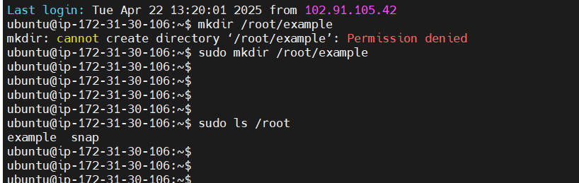
#
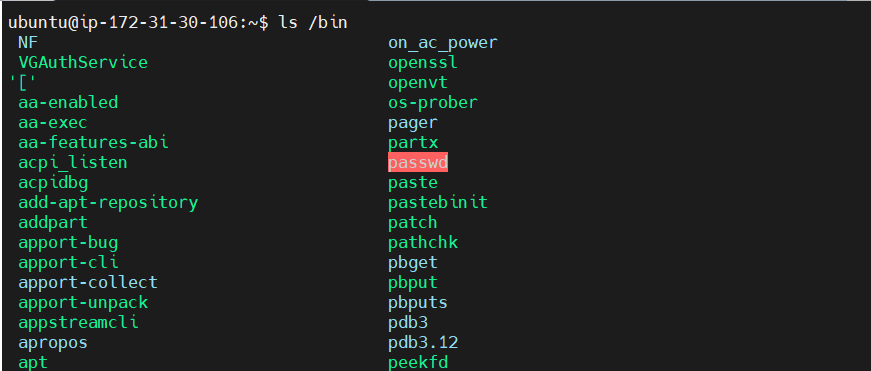
#
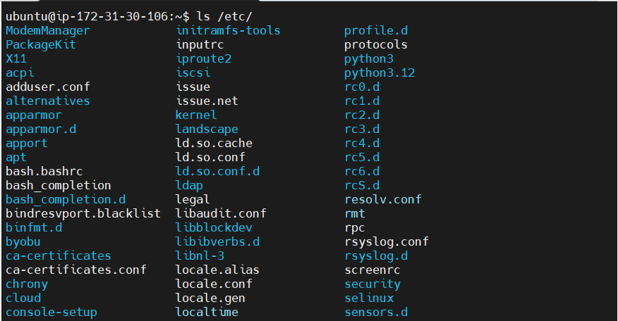
#
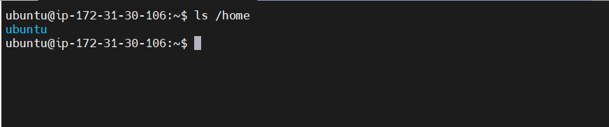
#
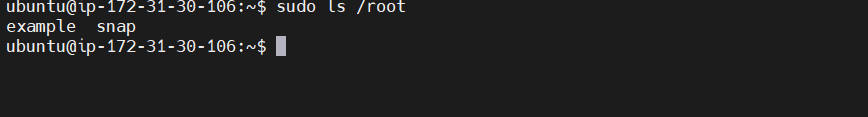
#
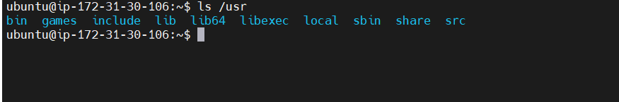
#
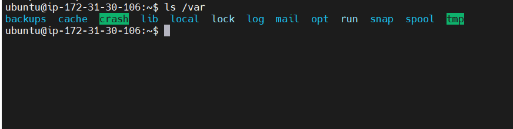
#
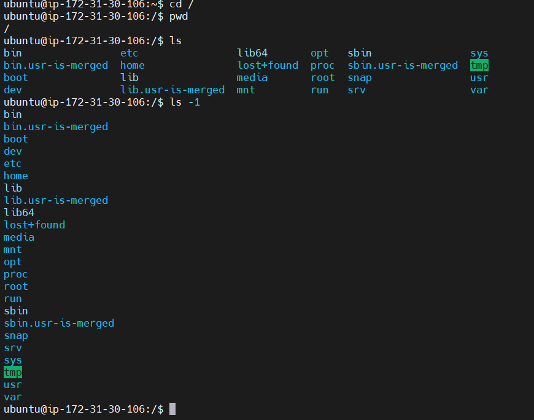
#
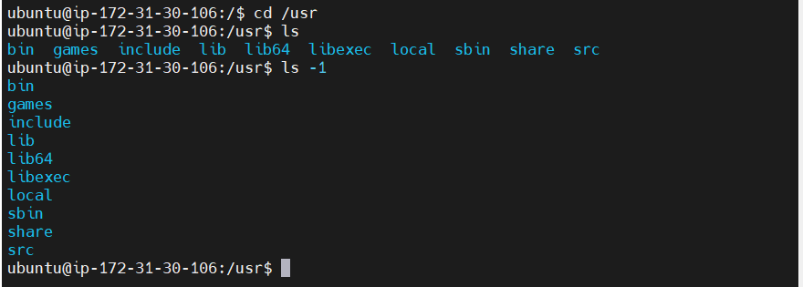
#
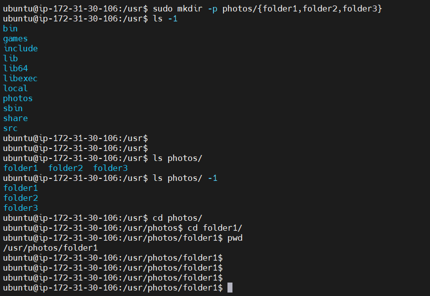
#
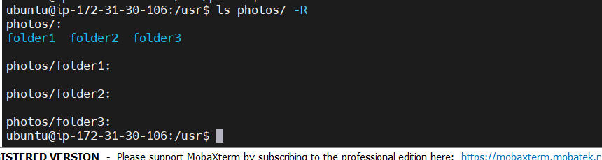
#
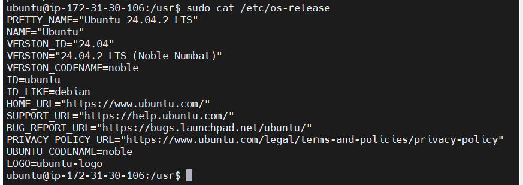
#
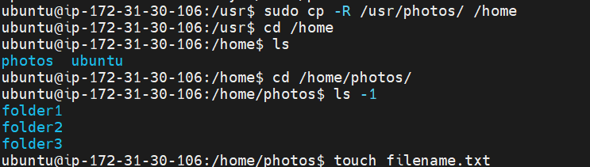
#
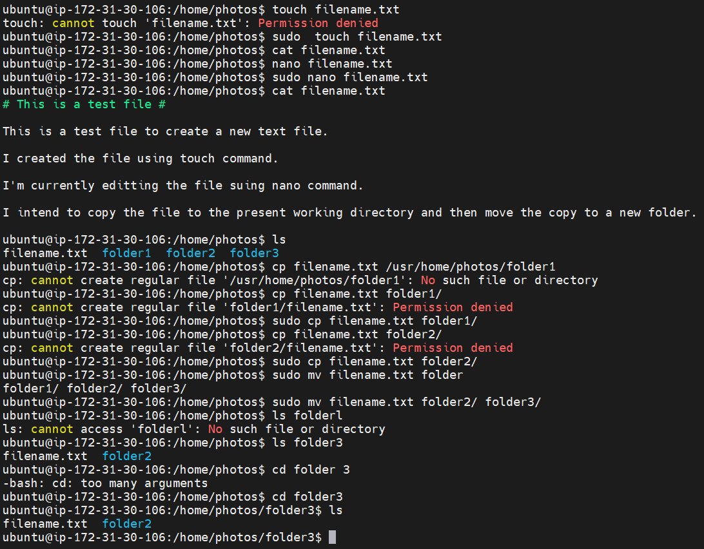
#
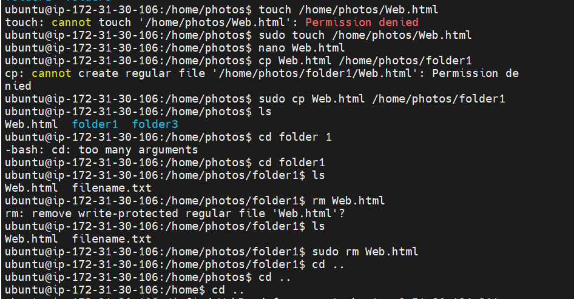
#
[touch_find_cmd](./img/img16touchfind.png)


### *Conclusion*
This README confirms the successful execution of all required Linux commands, system operations, and file management tasks in an Ubuntu VM, as was required by the instructor.
